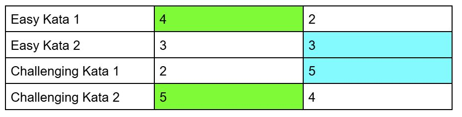

Room: 10  
Name: Fergus Gildea
Link: https://github.com/SchoolOfCode/week-6-hackathon-fergus-g 
  
# Team: MAC-10
# Counter Strike: Code Katas

Overview: An easy and a more challenging Kata thematically based on Counter Strike: Source
2 of 4 challenges are provided inside this repo.  The purpose of this repo is for peers to be able to challenge themselves with katas

For the other two challenges, please visit and download my teammates repo here:  
https://github.com/SchoolOfCode/week-6-hackathon-Hannalysis  -

------------

## Installation

Inside your VScode terminal, enter the following:

```bash
  npm install 
```
    
## Challenges & Context

Kata 1 [Easy] : Enemy Damage Calculator: enemyHealthCalculator

Kata 2: [Challenging] Clan Tag Sanitzer: addClanTagToName


To check whether you have succeeded the challenge, ensure to type in the following command inside the terminal:

```bash
  npm run test
```

<h2 align = "center">Documentation</h2>

  <h4 align = "center">Fist to Five - Fergus: Green | Hannah: Light Blue</h4>
<p align="center">
  
</p>

------------

<h3><u>Boundary Analysis Tables</u></h3>

<h4><i>enemyHealthCalculator Kata</i></h4>

|       | Test Case                               | Input | Output |
| ----- | --------------------------------------- | ----- | ------ |
| TC#1  | A pistol is used                        | Pistol| 80     |
| TC#2  | A RPG is used                           | RPG   | 0      |
| TC#3  | A SMG is used                           | SMG   | 95     |
| TC#4  | No weapon is input                      | ""    | 100    |
| TC#5  | When the gun has a negative value       | -33   | 133    |


<h4><i>addClanTagToName Kata</i></h4>

|	    |Test Case	                                                 |Input                 |Output|

| TC#1	|Valid player name and valid clan name	                     |"ChrisMeah", "SoC"         |"ChrisMeah[SoC]"
| TC#2	|Valid player name and invalid clan name (special characters)|"ChrisMeah", "SOC1!"	     |Throws error: "clan_name invalid"
| TC#3	|Valid player name and invalid clan name (length > 4)	     |"ChrisMeah", "SuperClan"   |Throws error: "clan_name invalid"
| TC#4	|Valid player name and invalid clan name (length < 4)	     |"ChrisMeah", "Cl"	         |Throws error: "clan_name invalid"
| TC#5	|Valid player name and valid clan name (uppercase letters)   |"FaisalVordermort", "SOC1" |"FaisalVordermort[SOC1]"
| TC#6	|Empty player name and valid clan name	                     |"", "SoC"	                 |Throws error: "player_name required"
| TC#7	|Valid player name and empty clan name	                     |"ChrisMeah", ""	         |Throws error: "clan_name invalid" 
  
  
------------

## Other Information
  
[Hackathon Presentation Slides](https://linktodocumentation)  
  
------------